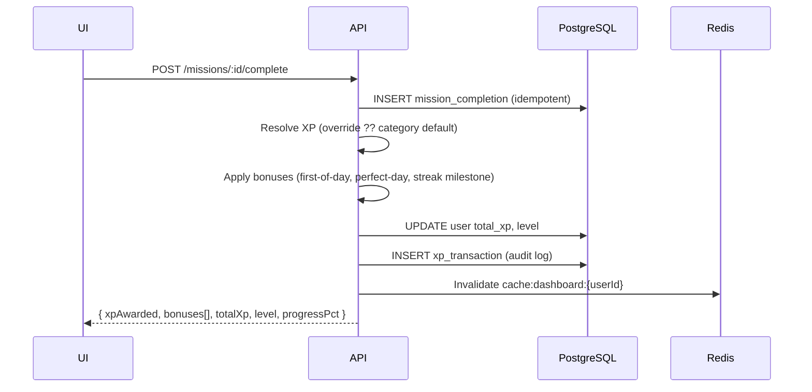

## Goal

**XP & level system** — award points on mission completion based on **category**, optional **per-mission override**, and **daily bonuses**. Persist in PostgreSQL; cache on dashboard via Redis.

**Parent:** TRY-16 · **Epic step:** 08 (TRY-55) · **Docs:** `docs/app-flow-and-business-logic.md` §7

---

## Why

- Gamifies daily missions without feeling arbitrary
- Heavier categories (deep work, English) reward more effort
- Bonuses encourage full-day completion and streak retention
- Single formula for level keeps UI predictable (progress bar, “Level 7”)

---

## XP by mission category (default)

| Category   | Slug       | Default XP | Rationale                          | Example mission              |
| ---------- | ---------- | ---------- | ---------------------------------- | ---------------------------- |
| English    | `english`  | **25**     | Learning + quiz = high effort      | Learn 10 English words       |
| Deep work  | `work`     | **25**     | Focus session / ticket completion  | Finish ticket TRY-44         |
| Coding     | `coding`   | **25**     | Same weight as deep work           | 1h coding session            |
| Fitness    | `fitness`  | **15**     | Shorter check-in                   | Exercise 20 mins             |
| Reading    | `reading`  | **15**     | Medium effort, passive             | Read 5 pages                 |
| Wellness   | `wellness` | **10**     | Light habit (water, meditate)      | Drink 8 glasses of water     |
| Custom     | `custom`   | **15**     | User-defined; editable per mission | Any user-created mission     |

**Rule:** `mission.xp_reward` overrides category default when set (min 5, max 100).

---

## Bonus XP (stackable unless noted)

| Event                         | XP    | Condition                                              | Notes                    |
| ----------------------------- | ----- | ------------------------------------------------------ | ------------------------ |
| Daily English challenge       | +25   | Submit daily English (separate from mission English)   | Once per day             |
| **Perfect day**               | +50   | Complete **all** active missions scheduled for today   | Once per day             |
| **Streak milestone**          | +100  | Streak hits 7, 14, 30, 60, 100 days                    | Once per milestone       |
| First mission of the day      | +5    | First completion after midnight (user TZ)              | Nudges “start the day”   |
| Weekly consistency ≥ 80%      | +75   | End of week job                                        | V2 — weekly report hook  |

**Perfect day** does not require Daily English unless English is listed as a mission that day.

---

## Level formula

```
xpForLevel(n)   = 100 × n × (n + 1) / 2    // total XP required to reach level n
levelFromXp(xp) = floor( (sqrt(8×xp/100 + 1) - 1) / 2 ) + 1

progressInLevel = (xp - xpForLevel(level)) / (xpForLevel(level+1) - xpForLevel(level))
```

| Level | Total XP required | XP to next level |
| ----- | ----------------- | ---------------- |
| 1     | 0                 | 100              |
| 2     | 100               | 200              |
| 3     | 300               | 300              |
| 7     | 2,800             | 700              |
| 8     | 3,500             | 800              |
| 10    | 5,500             | 1,000            |

**Dashboard example (matches marketing UI):** Level 7, 340 XP into level → `3,140 total XP`, bar ≈ 49% to Level 8.

---

## Award flow



---

## Data model additions

```sql
-- mission_categories (seed)
slug, name_key, default_xp_reward, sort_order

-- missions
xp_reward INT NULL  -- override; NULL = use category default

-- xp_transactions (audit)
id, user_id, amount, source_type, source_id, metadata JSONB, created_at

source_type enum:
  mission_complete | daily_english | perfect_day | streak_milestone
  | first_of_day | weekly_bonus | admin_adjust
```

---

## API

| Method | Path                     | XP behavior                          |
| ------ | ------------------------ | ------------------------------------ |
| POST   | `/missions/:id/complete` | Award + return breakdown             |
| GET    | `/dashboard`             | `totalXp`, `level`, `levelProgress`  |
| GET    | `/progress/xp`           | History + recent transactions (V2)   |

**Response fragment (`POST /missions/:id/complete`):**

```json
{
  "xpAwarded": 25,
  "bonuses": [{ "type": "first_of_day", "amount": 5 }],
  "totalXp": 3140,
  "level": 7,
  "levelProgress": 0.49
}
```

---

## Business rules

| Rule                         | Behavior                                                |
| ---------------------------- | ------------------------------------------------------- |
| Idempotent completion        | Same mission + same calendar day → no duplicate XP      |
| Undo completion (V2)         | Subtract XP if same day; recalc level                   |
| Level never below 1          | `max(1, levelFromXp(totalXp))`                          |
| Negative XP                  | Not allowed in MVP                                      |
| Category change              | Does not retroactively change past awards               |
| Timezone                     | “Today” and bonuses use `user.timezone` (IANA)          |

---

## Seed categories (MVP)

```ts
[
  { slug: 'english',  default_xp_reward: 25, sort_order: 1 },
  { slug: 'fitness',  default_xp_reward: 15, sort_order: 2 },
  { slug: 'work',     default_xp_reward: 25, sort_order: 3 },
  { slug: 'coding',   default_xp_reward: 25, sort_order: 4 },
  { slug: 'reading',  default_xp_reward: 15, sort_order: 5 },
  { slug: 'wellness', default_xp_reward: 10, sort_order: 6 },
  { slug: 'custom',   default_xp_reward: 15, sort_order: 99 },
]
```

Default signup missions (TRY-59): English (+25), Fitness (+15), Work (+25).

---

## UI copy alignment (web)

| Surface              | Values shown                          |
| -------------------- | ------------------------------------- |
| Hero mockup card     | English +20*, Exercise +15, Ticket +25 |
| Feature cards        | +25 / +15 / +25                       |
| Dashboard (future)   | Live values from API                  |

\*Hero demo uses +20 for visual variety; **API default for `english` category is 25**. Align mockup to +25 when wired to real data.

---

## Tasks

- [ ] Seed `mission_categories` with default XP
- [ ] `XpService.awardForMission(userId, missionId, date)` with override + category lookup
- [ ] Bonus evaluators: `first_of_day`, `perfect_day`, `streak_milestone`
- [ ] `levelFromXp` / `progressInLevel` pure functions + unit tests
- [ ] `xp_transactions` table + insert on every award
- [ ] Extend `POST /missions/:id/complete` response with XP breakdown
- [ ] Extend `GET /dashboard` with `totalXp`, `level`, `levelProgress`
- [ ] Invalidate Redis dashboard cache on XP change

---

## Acceptance criteria

- [ ] Completing English mission awards **25 XP** (unless override set)
- [ ] Completing fitness mission awards **15 XP**
- [ ] Second completion same mission same day awards **0 XP**
- [ ] Perfect day bonus (+50) fires once when last mission of the day is completed
- [ ] Level and progress bar match formula for documented examples
- [ ] All awards logged in `xp_transactions`
- [ ] Unit tests cover category defaults, overrides, bonuses, level boundaries

---

## Linear ticket body (copy-paste)

**Title:** XP & level system — category defaults, bonuses, level formula

**Description:**

Implement XP awards on mission completion per category (English/Work 25, Fitness/Reading 15, etc.), daily bonuses (perfect day +50, first mission +5, streak milestones), and level progression formula. Persist `total_xp` + `level` on user; audit via `xp_transactions`. See `.linear/TRY-55-xp-system.md`.

**Acceptance:** See checklist in spec doc.

**Estimate:** 5 · **Priority:** High · **Phase:** 2 Core backend · **Blocked by:** TRY-54 (missions complete)
