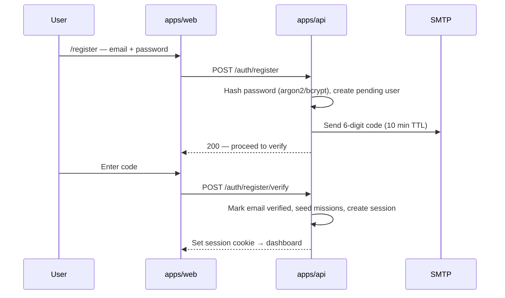

## Goal

**Sign Up** — register with **email + password**, then verify identity via a **6-digit code sent to email** before the account is activated.

**Parent:** TRY-16 · **Linear:** TRY-71 · **Docs:** `docs/app-flow-and-business-logic.md` §16

**Related:** TRY-69/70 (OAuth — parallel auth path) · Reuses mailer from contact form

---

## Flow



**Out of scope on this ticket:** OAuth buttons, Authenticator TOTP (TRY-TOTP ticket), magic link without password.

---

## Backend (`apps/api`)

### Schema (Prisma)

- [ ] `User.emailVerifiedAt DateTime?`
- [ ] `User.passwordHash` — already in schema; use argon2 or bcrypt
- [ ] `EmailOtp` (or `AuthCode`): `userId`, `codeHash`, `purpose` (`signup` | `login`), `expiresAt`, `attempts`, `createdAt`
- [ ] Rate limit: max 5 OTP sends / hour per email; max 5 verify attempts per code

### Routes

| Method | Path | Purpose |
| ------ | ---- | ------- |
| POST | `/auth/register` | `{ email, password }` → send OTP, return `{ pending: true }` |
| POST | `/auth/register/verify` | `{ email, code }` → verify, activate, session, seed missions |
| POST | `/auth/register/resend` | Resend signup OTP (cooldown 60s) |

### Validation

- Email: valid format, unique (or pending state handled)
- Password: min 8 chars (document rules in API + zod on web)
- Code: 6 digits, single-use, expires in **10 minutes**

### Email template

- [ ] Reuse mailer service (`services/mailer/`) — new template `signup-verification.ts`
- [ ] Subject: `Verify your Atomic Habits account`
- [ ] Light + dark inline styles (same pattern as contact email)

### Security

- [ ] Store **hashed** OTP (not plaintext)
- [ ] Invalidate code after successful verify or expiry
- [ ] Generic error messages (don’t reveal if email exists on register)

---

## Frontend (`apps/web`)

- [ ] `/register` — email + password + confirm password fields
- [ ] Step 2: OTP input (6 boxes or single field), resend link, countdown
- [ ] i18n EN + VI
- [ ] Link to Sign In; optional “Or continue with Google/GitHub/Twitter” when TRY-69 ships
- [ ] Design system: `TextInput`, validation errors, loading states

---

## Env vars

```
# Already have USER_MAIL, MAIL_PASSWORD for SMTP
OTP_EXPIRY_MINUTES=10
OTP_RESEND_COOLDOWN_SECONDS=60
```

---

## Acceptance criteria

- [ ] User can sign up with email + password
- [ ] 6-digit code arrives by email; wrong/expired code rejected
- [ ] After verify: user logged in, default missions seeded, `emailVerifiedAt` set
- [ ] Cannot use unverified account for dashboard
- [ ] Resend works with cooldown
- [ ] No OAuth-only restriction — this is the email/password path

---

## Estimate

**5** · **Priority:** High · **Phase:** 3 Auth
