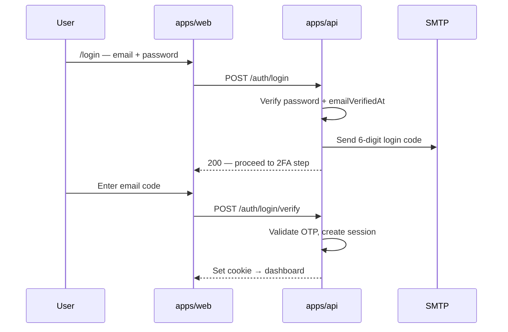

## Goal

**Sign In** — log in with **email + password**, then complete **email 2FA** (6-digit code sent to inbox) before a session is issued.

**Parent:** TRY-16 · **Linear:** TRY-72 · **Docs:** `docs/app-flow-and-business-logic.md` §16

**Blocked by:** TRY-71

---

## Flow

**Note:** Every login requires email code on this ticket. Optional “trust device 30 days” is out of scope (V2).

---

## Backend (`apps/api`)

### Routes

| Method | Path | Purpose |
| ------ | ---- | ------- |
| POST | `/auth/login` | `{ email, password }` → validate, send OTP (`purpose: login`) |
| POST | `/auth/login/verify` | `{ email, code }` → issue session cookie |
| POST | `/auth/login/resend` | Resend login OTP |
| POST | `/auth/logout` | Destroy session |

| GET | `/auth/me` | Current user (for client hydration) |

### Rules

- [ ] Reject login if `emailVerifiedAt` is null → redirect to complete signup
- [ ] Same OTP table + hashing as signup; `purpose: login`
- [ ] Session: HTTP-only cookie, `SESSION_SECRET`, secure in production
- [ ] CORS: `WEB_ORIGIN`

### Email template

- [ ] `login-verification.ts` — “Your sign-in code for Atomic Habits”

---

## Frontend (`apps/web`)

- [ ] `/login` — email + password form
- [ ] Step 2: email 2FA code entry (same OTP UI component as register)
- [ ] i18n EN + VI
- [ ] Link to Sign Up
- [ ] Wire nav **Sign In** → `/login`
- [ ] Middleware: protect dashboard routes; redirect unauthenticated → `/login`
- [ ] Redirect authenticated users away from `/login` → dashboard

---

## Acceptance criteria

- [ ] Valid credentials trigger email with 6-digit code
- [ ] Invalid password → generic error (no user enumeration)
- [ ] Correct code → session + redirect to dashboard
- [ ] Logout clears session
- [ ] Session persists on refresh
- [ ] Unverified email cannot sign in

---

## Estimate

**3** · **Priority:** High · **Phase:** 3 Auth
