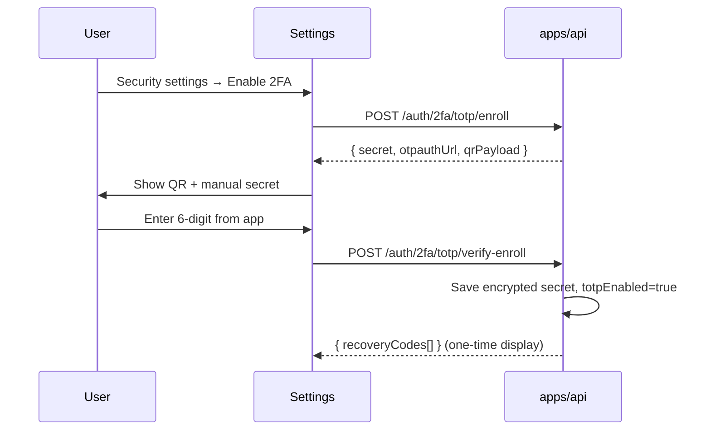
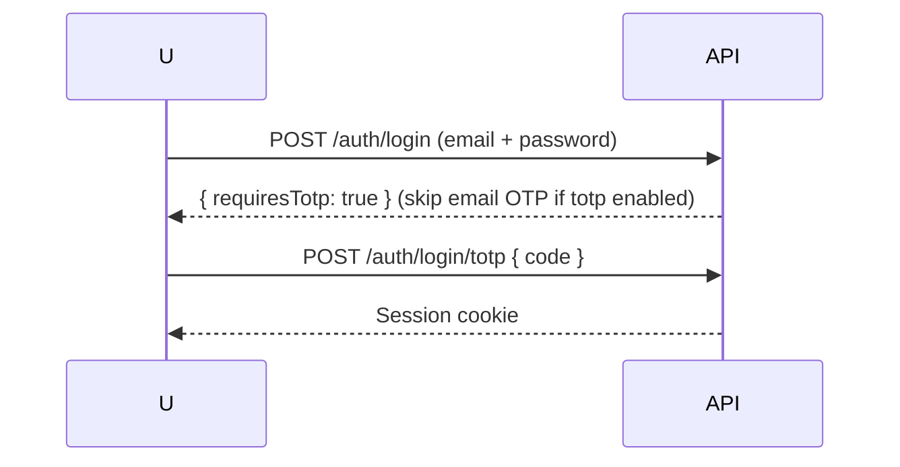

## Goal

**Two-factor authentication (Authenticator app)** — optional TOTP (Google Authenticator, Authy, 1Password) as a **second step after** email/password + email code, or as a **replacement** for email 2FA on login once enrolled.

**Parent:** TRY-16 · **Linear:** TRY-73 · **Docs:** `docs/app-flow-and-business-logic.md` §16

**Blocked by:** TRY-72

---

## Recommended policy

| Stage | Behavior |
| ----- | -------- |
| Not enrolled | Login = password → email code only |
| Enrolled | Login = password → email code → **TOTP code** (or password → TOTP if email 2FA disabled after enroll — **pick one in implementation**) |

**Default for MVP:** After TOTP enrollment, login requires **password + TOTP**; email code only for signup verification and password recovery (future).

Document final policy in PR description.

---

## Flow — Enroll



---

## Flow — Login with TOTP



---

## Backend (`apps/api`)

### Schema

- [ ] `User.totpSecretEncrypted String?` — encrypt at rest (AES or libsodium)
- [ ] `User.totpEnabled Boolean @default(false)`
- [ ] `User.totpVerifiedAt DateTime?`
- [ ] `RecoveryCode` — hashed one-time backup codes (8 codes, single use)

### Routes

| Method | Path | Purpose |
| ------ | ---- | ------- |
| POST | `/auth/2fa/totp/enroll` | Authenticated — generate secret + otpauth URL |
| POST | `/auth/2fa/totp/verify-enroll` | Confirm first TOTP code, enable 2FA |
| POST | `/auth/login/totp` | Submit TOTP during login |
| DELETE | `/auth/2fa/totp` | Disable 2FA (require password + current TOTP) |
| POST | `/auth/2fa/recovery` | Login with recovery code (once) |

### Library

- [ ] `otplib` or `@otplib/preset-default` — TOTP verify, 30s window, ±1 step skew

### Security

- [ ] Never log or return plaintext `totpSecret` after enroll response
- [ ] Recovery codes stored hashed (like passwords)
- [ ] Rate-limit TOTP attempts (5 / 15 min)

---

## Frontend (`apps/web`)

- [ ] Settings page section: **Two-factor authentication**
- [ ] Enroll UI: QR code (`qrcode.react` or similar), manual key copy, verify input
- [ ] Show recovery codes once — user must confirm saved
- [ ] Login step: TOTP input when `requiresTotp`
- [ ] “Use recovery code” link on login
- [ ] i18n EN + VI

---

## Acceptance criteria

- [ ] User can enroll via Authenticator app (QR scan works)
- [ ] Login with enrolled account requires valid TOTP
- [ ] Invalid TOTP rejected; rate limited
- [ ] Recovery code works once, then invalidated
- [ ] User can disable 2FA with password + TOTP
- [ ] Secret encrypted in database

---

## Env vars

```
TOTP_ISSUER=Atomic Habits
TOTP_ENCRYPTION_KEY=  # 32-byte key for secret encryption
```

---

## Estimate

**5** · **Priority:** Medium · **Phase:** 3 Auth (after email login)
