# Atomic Habits — App Flow & Business Logic

> **Positioning:** A personal growth operating system — _Linear + Duolingo for self-improvement_  
> Not a todo app. A daily system for missions, streaks, learning, and visible progress.

**Related:** Linear epic [TRY-16](https://linear.app/trysomethign/issue/TRY-16)

---

## 1. What the user can do

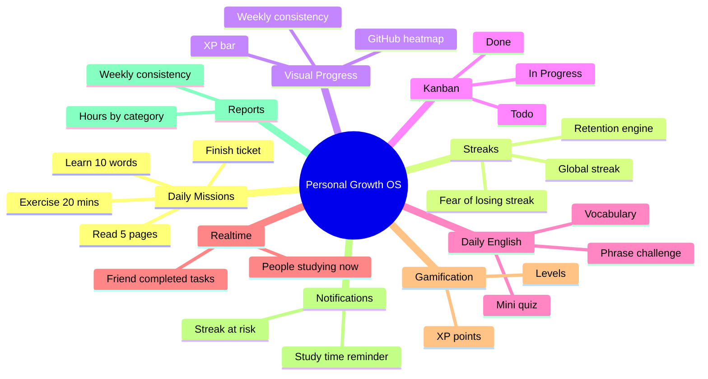

| #   | Capability              | User value                       | Tech highlight       |
| --- | ----------------------- | -------------------------------- | -------------------- |
| 1   | **Daily missions**      | Clear daily targets              | PostgreSQL           |
| 2   | **Streaks**             | Retention — user fears losing 🔥 | Redis cache + TTL    |
| 3   | **Visual progress**     | "I'm improving" feeling          | Heatmap from history |
| 4   | **Personal Kanban**     | Self-growth task board           | PostgreSQL           |
| 5   | **Daily English**       | Reason to return every day       | Content + quiz API   |
| 6   | **Realtime motivation** | Light social pressure            | Redis Pub/Sub        |
| 7   | **XP / Levels**         | Gamification                     | Redis + PostgreSQL   |
| 8   | **Smart notifications** | Right-time nudges                | BullMQ + Redis queue |
| 9   | **Weekly reports**      | Reflection + consistency %       | Aggregated stats     |

---

## 2. MVP vs Future

```mermaid
flowchart LR
    subgraph MVP["MVP — ship first"]
        A1[Auth]
        A2[Daily missions]
        A3[Streak 🔥]
        A4[Heatmap]
        A5[XP system]
        A6[Daily English]
        A7[Redis layer]
    end

    subgraph V2["V2 — after MVP"]
        B1[Kanban board]
        B2[Realtime feed]
        B3[Smart notifications]
        B4[Weekly reports]
    end

    subgraph Future["Future"]
        C1[AI Coach]
        C2[AI English correction]
        C3[Team rooms]
        C4[Shared sessions]
    end

    MVP --> V2 --> Future
```

### MVP must-have

- Auth
- Daily missions (create + complete today's list)
- **Global streak** (complete ≥1 mission per day keeps streak alive)
- Activity **heatmap** (GitHub-style)
- **XP + level** on mission complete
- **Daily English challenge** (vocabulary or mini quiz)
- **Redis:** cache dashboard, sorted sets (leaderboard prep), TTL daily resets, Pub/Sub (realtime), BullMQ (notification jobs)

### V2 (strong but after core loop works)

- Personal Kanban (Todo / In Progress / Done)
- Realtime motivation ("5 people studying now")
- Smart notifications ("Don't lose your 14-day streak")
- Weekly reports (82% consistency, hours English, goals done)

### Future

- AI Coach, AI English correction, team accountability rooms, shared study sessions

---

## 3. System architecture

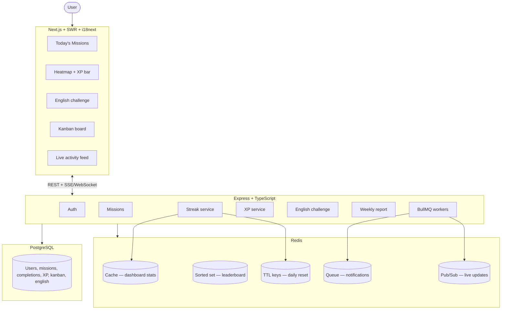

**Rule of thumb**

| Data                            | Store            | Why                     |
| ------------------------------- | ---------------- | ----------------------- |
| Users, missions, history        | PostgreSQL       | Source of truth         |
| Today's dashboard, streak count | Redis cache      | Fast reads              |
| Leaderboard ranks               | Redis sorted set | O(log N) ranking        |
| Midnight / daily reset flags    | Redis TTL        | Auto-expire per user TZ |
| Live "studying now"             | Redis Pub/Sub    | Push to clients         |
| Reminder jobs                   | BullMQ           | Scheduled, retryable    |

---

## 4. Main user journey (one picture)

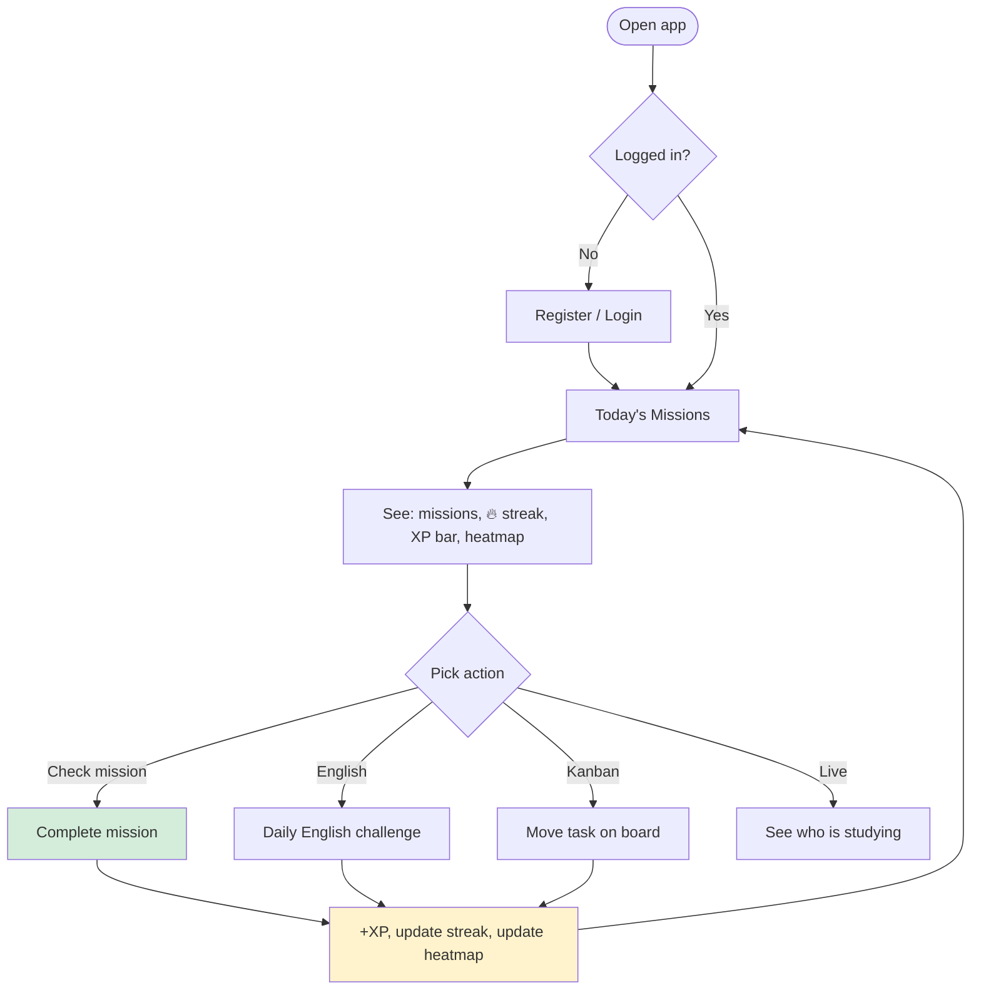

---

## 5. Daily missions

### 5.1 Concept

Missions are **concrete daily targets**, not vague habits.

| Example mission        | Category |
| ---------------------- | -------- |
| Learn 10 English words | english  |
| Read 5 pages           | reading  |
| Finish ticket TRY-44   | work     |
| Exercise 20 mins       | fitness  |

### 5.2 UI (Today's Missions)

```
Today's Missions                    🔥 28-day streak
━━━━━━━━━━━━━━━━━━━━━━━━━━━━━━━━━━━━━━━━━━━━━━━━━━
[ ] Learn 10 English words          +20 XP
[✓] Exercise 20 mins                +15 XP
[ ] Finish ticket TRY-44            +25 XP

Today: 1/3 complete    Level 7  ████████░░ 340/500 XP
```

### 5.3 Flow

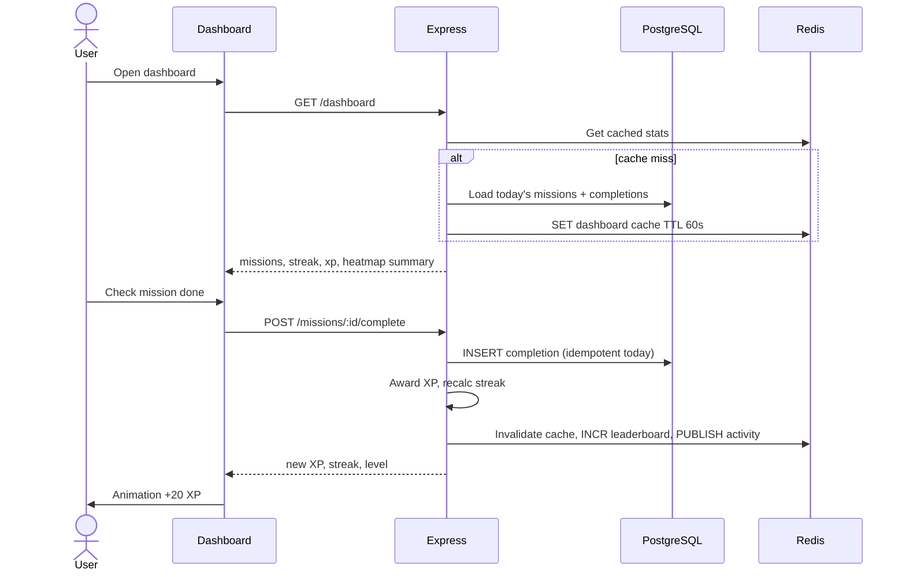

### 5.4 Business rules

| Rule                               | Behavior                                                |
| ---------------------------------- | ------------------------------------------------------- |
| One completion per mission per day | DB unique `(userId, missionId, date)`                   |
| Create mission                     | User can add/edit/delete their daily missions           |
| Default templates                  | Optional seeds on signup (English, Workout, Coding)     |
| Complete mission                   | Awards XP (configurable per mission or category)        |
| All missions optional              | Streak only needs **≥1 completion any mission** per day |

---

## 6. Streaks (retention engine)

### 6.1 What counts

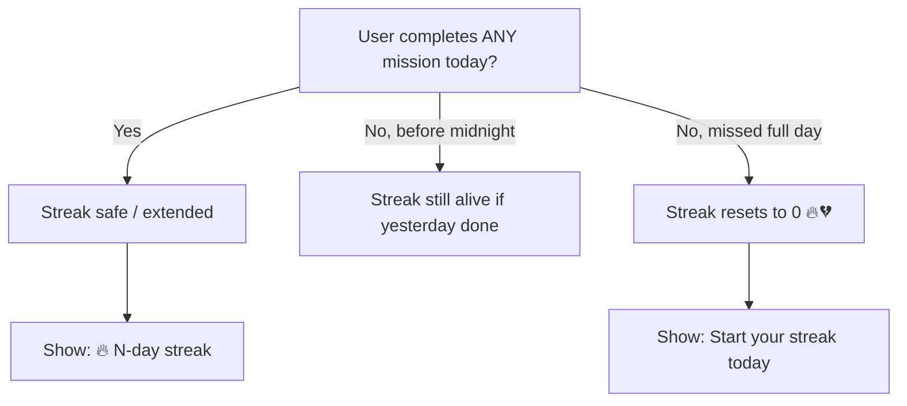

**Global streak** (MVP): one number for the whole app — user completed at least one mission on consecutive calendar days.

Per-mission streaks = future enhancement.

### 6.2 Redis role

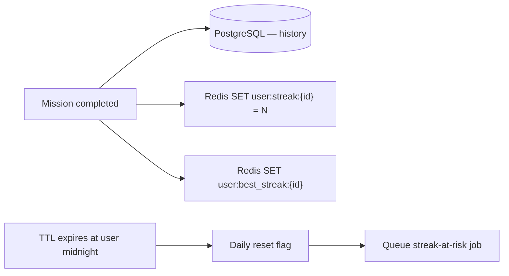

| Redis key                           | Purpose                                        |
| ----------------------------------- | ---------------------------------------------- |
| `user:streak:{userId}`              | Current streak (fast read)                     |
| `user:best_streak:{userId}`         | Personal best                                  |
| `user:active_today:{userId}:{date}` | Did user complete anything today?              |
| `user:streak_at_risk:{userId}`      | TTL → trigger "don't lose streak" notification |

### 6.3 Streak algorithm (global)

Uses user **timezone** for "today".

```
function globalStreak(completionDates[], today):
  if no completions: return 0

  last = most recent date with ANY mission completed

  if last < today - 1 day:
    return 0   // missed yesterday and today

  streak = 1
  walk backward from last while previous day also has completion:
    streak++

  return streak
```

**Alive rule:** If user completed yesterday but not yet today, streak still shows until end of today.

### 6.4 Examples

| Completion dates (any mission) | Today  | Streak            |
| ------------------------------ | ------ | ----------------- |
| May 29                         | May 29 | 1                 |
| May 28, 29                     | May 29 | 2                 |
| May 27, 29 (skipped 28)        | May 29 | 1                 |
| May 25–28 (not May 29 yet)     | May 29 | 4 (still alive)   |
| May 25–27                      | May 29 | 0 (missed May 28) |

---

## 7. XP & levels

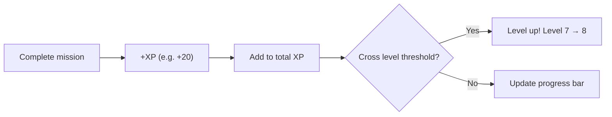

| Event                      | XP (example) |
| -------------------------- | ------------ |
| Complete daily mission     | +15 to +30   |
| Finish Daily English       | +25          |
| Full day all missions done | +50 bonus    |

```
Level formula (example): level = floor(sqrt(totalXp / 100)) + 1
```

Store `total_xp` and `level` on user in PostgreSQL; cache in Redis for dashboard.

---

## 8. Visual progress

```mermaid
flowchart TB
    subgraph Dashboard widgets
        H[Heatmap — last 12 weeks]
        X[XP bar — level progress]
        W[Weekly consistency — 82%]
        P[Today completion — 67%]
    end

    PG[(completion history)] --> H
    PG --> W
    User XP --> X
    Today missions --> P
```

### Heatmap

- One cell per day; intensity = missions completed (0 = empty, 1–2 = light, 3+ = dark)
- Same model as GitHub contributions
- Data: `GET /progress/heatmap?weeks=12`

### Weekly consistency

```
consistency = days_with_at_least_one_completion / 7
```

---

## 9. Personal Kanban

Focus: **self-growth, learning, habits** — not generic project management.

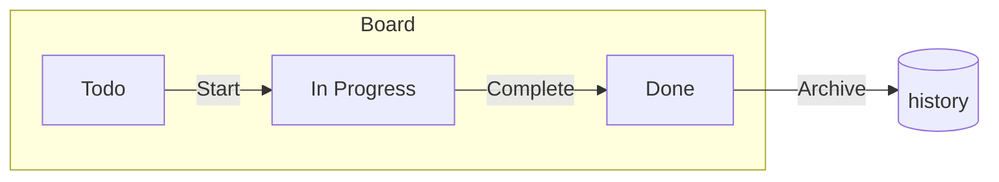

| Column          | Examples                             |
| --------------- | ------------------------------------ |
| **Todo**        | Read Atomic Habits ch.3, Setup Redis |
| **In Progress** | Build streak service                 |
| **Done**        | Ship auth flow                       |

Kanban tasks are **separate from daily missions** but completing a kanban card can optionally award XP (V2).

---

## 10. Daily English system

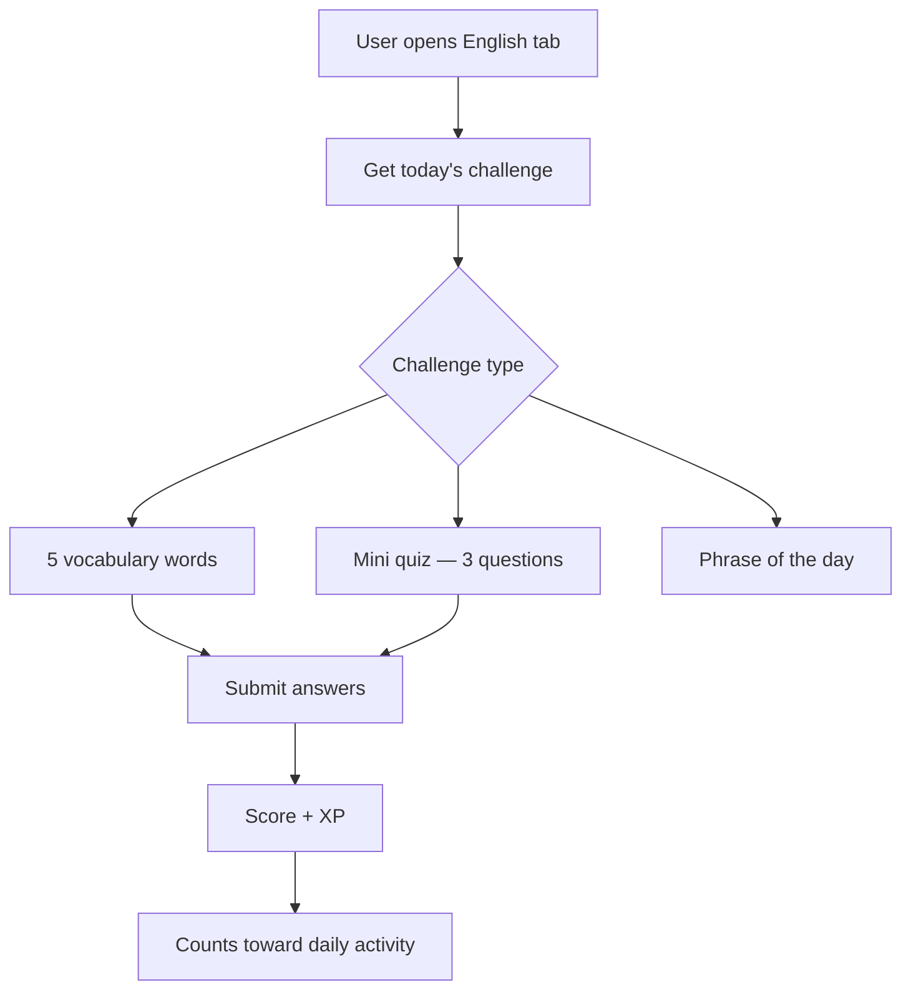

**MVP:** One challenge type per day (rotate or random).

**Return loop:** New content every day → reason to open the app.

---

## 11. Realtime motivation

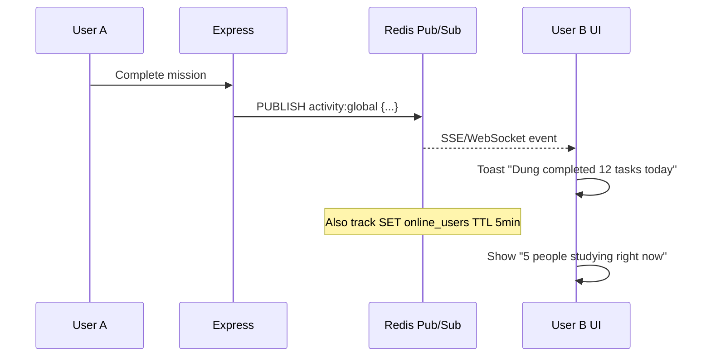

Light social pressure — no heavy social network in MVP.

---

## 12. Smart notifications

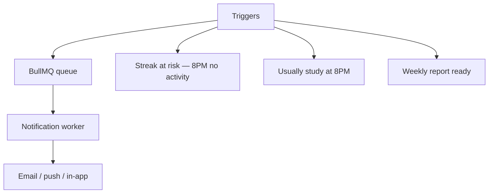

| Notification   | When                                             |
| -------------- | ------------------------------------------------ |
| Streak at risk | User has streak ≥3, no completion today, evening |
| Study habit    | ML/simple: usual study hour from history         |
| Weekly report  | Sunday morning                                   |

---

## 13. Weekly report

```
This week (May 22–28)
━━━━━━━━━━━━━━━━━━━━
✓ 82% consistency (6/7 days)
✓ 6.2 hours English
✓ 4 goals completed
🔥 Streak: 28 days
+340 XP earned
```

Generated by aggregating PostgreSQL completions; optional email via BullMQ.

---

## 14. Screen map

```mermaid
flowchart TD
    Root([/]) --> AuthCheck{Auth?}
    AuthCheck -->|No| Login[/login]
    AuthCheck -->|No| Register[/register]
    AuthCheck -->|Yes| Dashboard[/dashboard]

    Dashboard --> Missions[Today's Missions]
    Dashboard --> Progress[/progress — heatmap + XP]
    Dashboard --> English[/english — daily challenge]
    Dashboard --> Kanban[/board — kanban]
    Dashboard --> Settings[/settings]

    Settings --> TZ[Timezone]
    Settings --> Lang[Language EN/VI]
    Settings --> Notif[Notification prefs]
```

---

## 15. Data model (core)

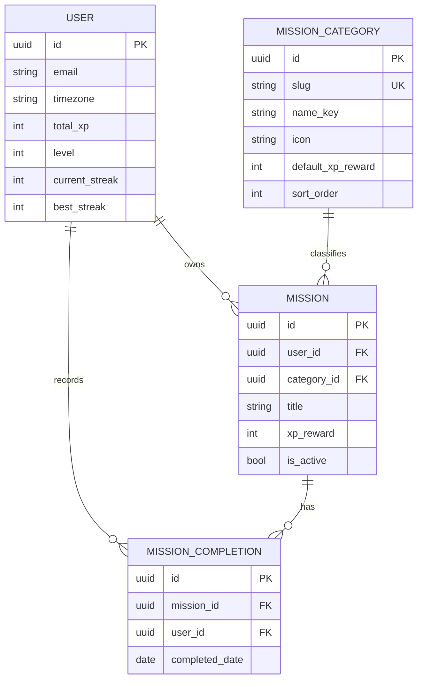

---

## 16. API summary

| Method                | Path                     | Purpose                                 |
| --------------------- | ------------------------ | --------------------------------------- |
| POST                  | `/auth/register`         | Sign up + optional default missions     |
| POST                  | `/auth/login`            | Session                                 |
| GET                   | `/dashboard`             | Missions today, streak, XP, quick stats |
| GET/POST/PATCH/DELETE | `/missions`              | CRUD daily missions                     |
| POST                  | `/missions/:id/complete` | Mark done today (+XP, streak)           |
| GET                   | `/progress/heatmap`      | Heatmap cells                           |
| GET                   | `/progress/weekly`       | Consistency + hours                     |
| GET/POST/PATCH        | `/board/tasks`           | Kanban CRUD                             |
| GET                   | `/english/today`         | Today's challenge                       |
| POST                  | `/english/today/submit`  | Submit answers                          |
| GET                   | `/reports/weekly`        | Weekly report                           |
| GET                   | `/live/activity`         | SSE — realtime feed                     |

---

## 17. Redis keys reference

| Pattern                    | Type          | Use                          |
| -------------------------- | ------------- | ---------------------------- |
| `cache:dashboard:{userId}` | STRING (JSON) | Dashboard aggregate, TTL 60s |
| `streak:current:{userId}`  | STRING        | Current streak               |
| `streak:best:{userId}`     | STRING        | Best streak                  |
| `active:{userId}:{date}`   | STRING        | Completed something today    |
| `leaderboard:weekly`       | SORTED SET    | XP ranks (prep for V2)       |
| `online:users`             | SET + TTL     | Count studying now           |
| `channel:activity`         | PUB/SUB       | Live completion events       |

---

## 18. Implementation order

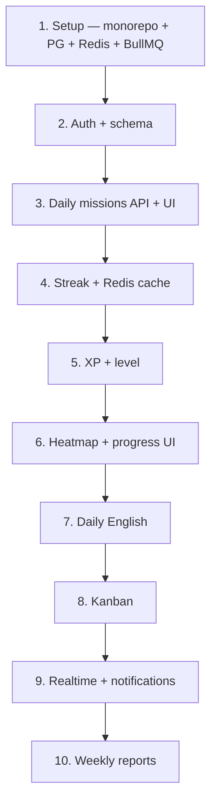

---

## 19. Glossary

| Term              | Meaning                                     |
| ----------------- | ------------------------------------------- |
| **Mission**       | A specific daily task ("Learn 10 words")    |
| **Completion**    | User marked mission done for a calendar day |
| **Global streak** | Consecutive days with ≥1 mission completed  |
| **XP**            | Points earned; drives levels                |
| **Heatmap**       | Grid showing daily activity intensity       |
| **Today**         | Calendar date in user's IANA timezone       |

---

## 20. Why this app is strong

**For users:** Concrete daily missions + streak fear + visible progress + English habit loop = real self-improvement, not another todo list.

**For engineering:** Showcases Next.js, Express, PostgreSQL, Redis (cache, sorted sets, TTL, Pub/Sub), BullMQ, realtime, and event-driven design — a portfolio-grade full-stack product.
